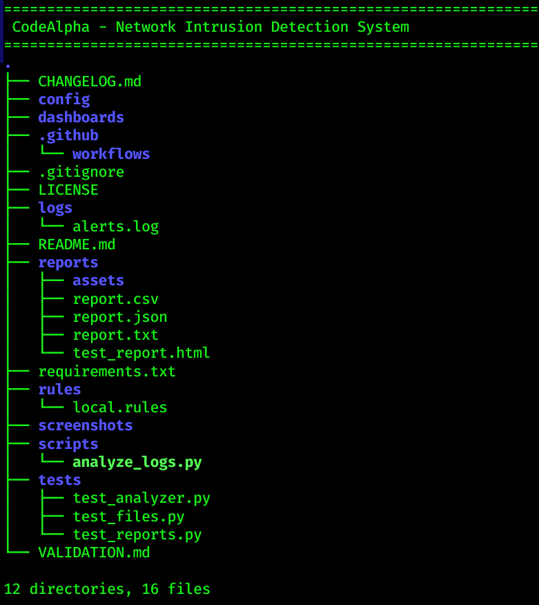
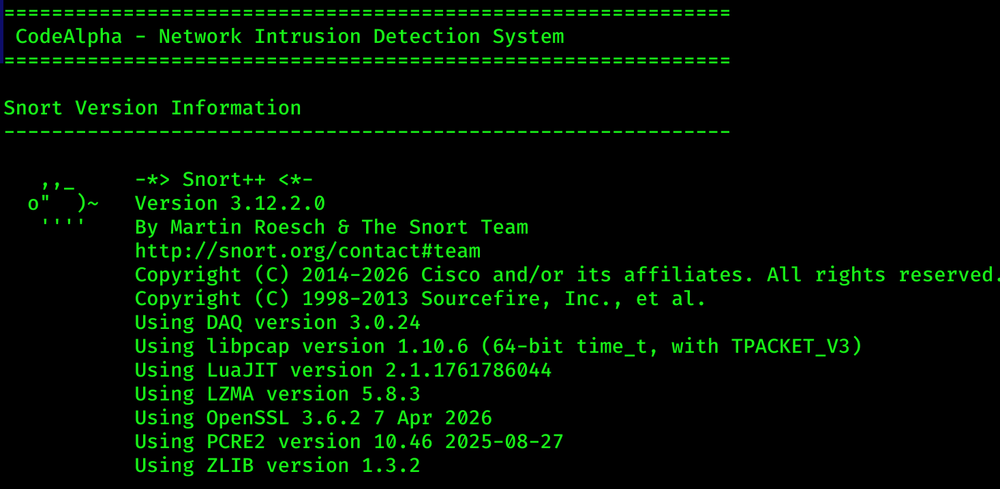
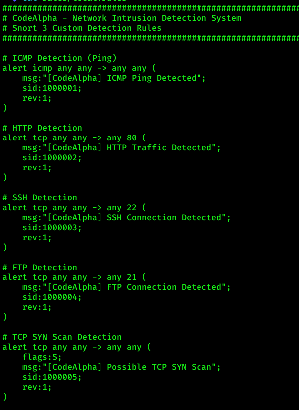
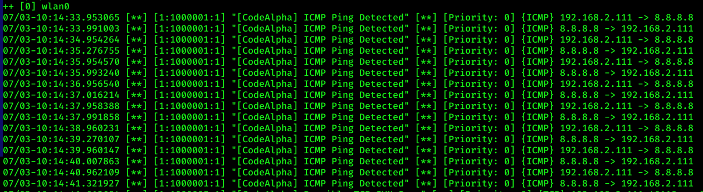
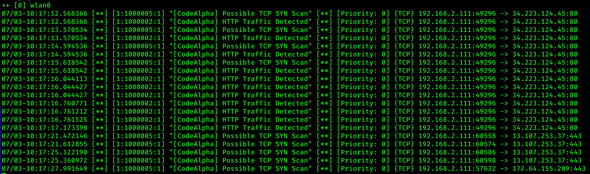
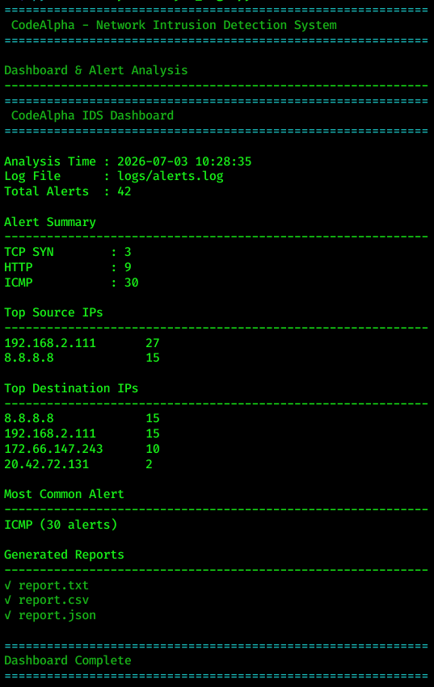
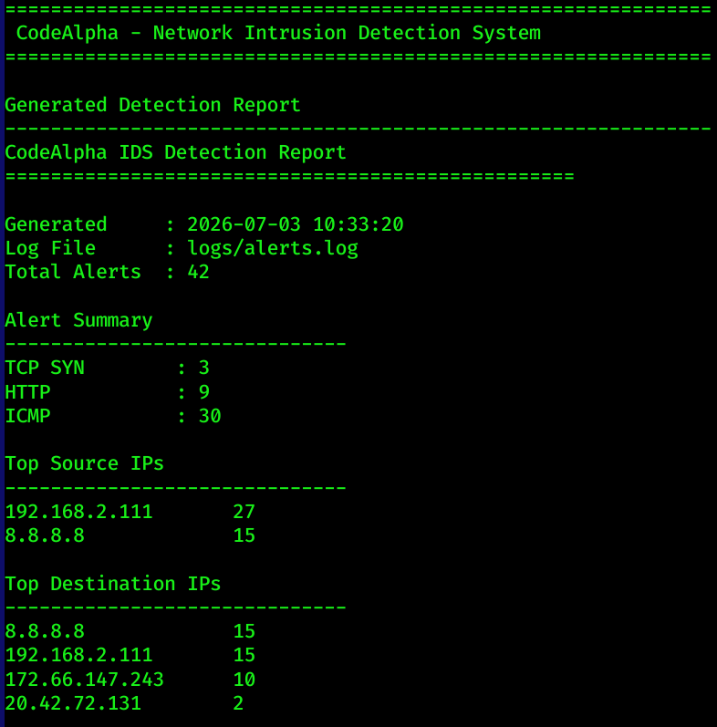
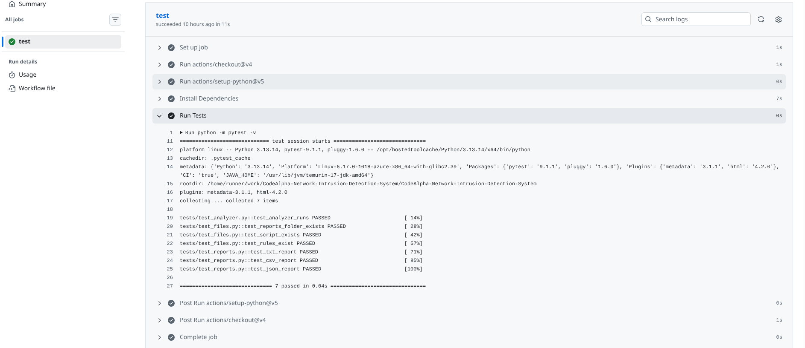

# 🛡️ CodeAlpha - Network Intrusion Detection System

A professional **Network Intrusion Detection System (NIDS)** developed using **Snort 3** and **Python** for detecting suspicious network activities in real time.

This project monitors live network traffic, applies **custom Snort detection rules**, captures security events, performs automated alert analysis, and generates professional reports in **TXT**, **CSV**, and **JSON** formats. It also provides a real-time dashboard that summarizes detected network events, top source and destination IP addresses, and alert statistics.

Developed as part of the **CodeAlpha Cyber Security Internship**, this project demonstrates practical knowledge of intrusion detection, rule development, packet inspection, log analysis, report generation, software testing, and continuous integration using **GitHub Actions**.

---

# 📑 Table of Contents

- [Features](#-features)
- [Screenshots](#-screenshots)
- [Project Structure](#-project-structure)
- [Installation](#-installation)
- [Usage](#-usage)
- [Custom Detection Rules](#-custom-detection-rules)
- [Live Packet Monitoring](#-live-packet-monitoring)
- [Dashboard & Alert Analysis](#-dashboard--alert-analysis)
- [Generated Reports](#-generated-reports)
- [Automated Testing](#-automated-testing)
- [Technologies Used](#technologies-used)
- [Future Improvements](#-future-improvements)
- [Contributing](#-contributing)
- [License](#-license)
- [Author](#author)

---

# 🚀 Features

| Feature | Status |
|----------|:------:|
| Snort 3 Integration | ✅ |
| Custom Detection Rules | ✅ |
| ICMP Detection | ✅ |
| HTTP Detection | ✅ |
| SSH Detection | ✅ |
| FTP Detection | ✅ |
| TCP SYN Scan Detection | ✅ |
| Live Packet Monitoring | ✅ |
| Alert Analysis Dashboard | ✅ |
| TXT Report Generation | ✅ |
| CSV Report Generation | ✅ |
| JSON Report Generation | ✅ |
| Professional CLI Output | ✅ |
| Automated Testing | ✅ |
| GitHub Actions CI | ✅ |
| MIT License | ✅ |

---

# 📸 Screenshots

The following screenshots demonstrate the implementation and functionality of the Network Intrusion Detection System.

---

## 1️⃣ Project Structure

Shows the complete project directory structure including Snort rules, reports, scripts, tests, GitHub Actions workflow, and supporting files.

---

## 2️⃣ Snort Version

Displays the installed Snort 3 version and runtime environment used for the project.

---

## 3️⃣ Custom Detection Rules

Shows the custom Snort detection rules implemented for identifying various network activities.

**Implemented Rules**

- ICMP Ping Detection
- HTTP Traffic Detection
- SSH Connection Detection
- FTP Connection Detection
- TCP SYN Scan Detection

---

## 4️⃣ ICMP Detection

Demonstrates successful detection of ICMP (Ping) traffic generated during live packet monitoring.

---

## 5️⃣ HTTP & TCP SYN Detection

Shows simultaneous detection of HTTP traffic and TCP SYN scan attempts using custom Snort rules.

---

## 6️⃣ Dashboard & Alert Analysis

Displays the automatically generated dashboard summarizing intrusion detection results, alert counts, and network statistics.

---

## 7️⃣ Generated Report

Illustrates the professionally generated detection report containing alert summaries, source/destination IPs, and analysis results.

---

## 8️⃣ GitHub Actions (CI/CD)

Demonstrates successful execution of automated testing through GitHub Actions Continuous Integration.

---